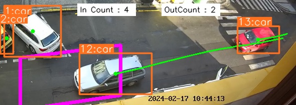

# Sčítač dopravy

Scripts for video-based automated counting of car traffic.
The yolov8 model is used for vehicle detection and tracking.

## Installation

```sh
pip -m venv .venv
source .venv/bin/activate

pip install -r requirements.txt
```

## Configuration

Detection script configuration is by default read from the `config-live.yaml` file.
The file provides reasonable defaults for detecting vehicles in a live video stream.
The detection region should be adjusted based on the given location.

## Vehicle detection

Start the detection script by running:

```sh
python detect.py <live stream URL>
```

A preview of the augmented video stream will pop up.



An empty file is created in `workdir` every time a vehicle is detected.
The file name contains a timestamp of when the detection occurred.
The files are organized in nested folders based on the date.
